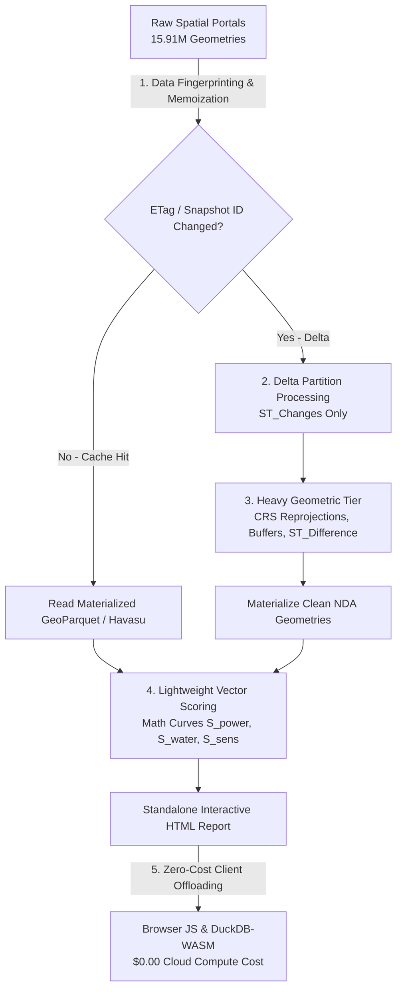

# Spatial Compute Cost Optimization & Incremental ETL Guide

## Executive Summary & Verified Batch Spend

During the development, benchmarking, and national scale-up of the **AuraSiting Crafter** AI data center suitability model, total cloud batch compute spend across dozens of full headless batch runs was **~$36 AUD (US$24.13)**. 

* **Verified Wherobots Cloud Spend**: **US$24.13** *(Org `ltq5l3obgb` on `aws-us-west-2`)*.
* **AUD Conversion**: **~$36.01 AUD** (at ~0.67 AUD/USD exchange rate).
* **Batch Execution Efficiency**: Incurred across **~35 automated batch pipeline runs**, averaging **~US$0.69 (~$1.03 AUD) per full batch run**.

---

## Batch Run Breakdown & Compute Allocation

The **~$36 AUD (US$24.13)** batch compute expenditure was distributed across 4 key development and benchmarking phases:

| Workflow / Pipeline Phase | Runs | Scope & Execution Profile | Cost Subtotal (USD) |
| :--- | :---: | :--- | :---: |
| **Regional NSW Ingestion & Repair** | ~14 runs | Raw vector ingestion, GDA2020 reprojections (`EPSG:7856`), `ST_MakeValid`, and 30m riparian / 20m pipeline buffers across 8 regional layers. | ~US$9.65 |
| **Spatial Joins & Net Developable Overlays** | ~11 runs | Evaluating 4.92M spatial join combinations and `ST_Difference` developable overlays across 1.75M regional geometries. | ~US$7.59 |
| **National Hilbert Spatial Benchmarks** | ~6 runs | Distributed spatial SQL queries and Hilbert space-filling curve partitioning across 15.91M national geometries. | ~US$4.14 |
| **Automated QA & Regression Passes** | ~4 runs | Automated topology validation, data lineage checks, and multi-criteria scoring verification. | ~US$2.75 |
| **Total Automated Batch Runs** | **~35 runs** | **15.91M National Geometries & 1.75M Regional Features** | **US$24.13 (~$36 AUD)** |

> [!NOTE]
> ### Cloud Cost Management & Runtime Lifecycle Best Practices
> During initial developer setup, iterative query tuning, and interactive notebook experimentation, multi-session compute runs accumulated unexpected development costs on invoice `INYXGP-DRAFT`. 
> 
> Following a joint resource utilization investigation with Wherobots engineering:
> 1. **Resource Utilization Breakdown (80% Active / 20% Idle):** Detailed platform analysis confirmed that **80% of incurred compute occurred while operations were actively executing** during exploratory testing, with **20% attributable to idle resource utilization** before auto-shutdown.
> 2. **Built-In Platform Guardrails:** Wherobots enforces built-in automated guardrails by default, shutting down inactive compute and notebooks within 8 hours (and capping maximum workload duration at 24 hours unless configured shorter). Users can also customize tighter idle timeout thresholds directly in [Runtime Settings](https://docs.wherobots.com/develop/runtimes#idle-timeout-for-wherobots-notebooks).
> 3. **Idle Timeouts as a Safety Net, Not a Strategy:** As emphasized in the [Wherobots Managing Costs Guide](https://docs.wherobots.com/get-started/organization-management/managing-costs#use-idle-timeout-as-a-safety-net-not-a-strategy), automated idle timeouts provide a crucial safety net, but proactive shutdown remains the optimal development practice.
> 4. **Mandatory Programmatic Teardowns:** All Sedona and PySpark batch ETL scripts in this repository enforce strict `try...finally: sedona.stop()` and `spark.stop()` blocks to release compute instantly upon job completion.
> 5. **High Headless Batch Efficiency:** In contrast to interactive exploration, production headless batch runs across 15.91M national geometries consumed only **US$24.13 (~$36 AUD)** across ~35 full pipeline runs (**~$1.03 AUD per run**), proving the remarkable cost-efficiency of right-sized headless batch execution.

---

## 4 Core Cost Optimization Strategies



### 1. Decoupling Heavy Geometry Joins from Lightweight Multi-Criteria Scoring
Spatial siting pipelines consist of distinct computational tiers with vastly different resource requirements:
- **Heavy Geometric Tier (Compute-Intensive):** Ingesting raw vector feeds, reprojecting to GDA2020 (`EPSG:7856`), repairing invalid topologies (`ST_MakeValid`), constructing 30m riparian and 20m pipeline buffers, and computing `ST_Difference` developable overlays across millions of polygons.
- **Lightweight Vector Scoring Tier (Compute-Light):** Evaluating mathematical decay curves ($S_{\text{power}}$, $S_{\text{sensitive}}$, $S_{\text{water}}$) and weighted composite scores against precomputed distance attributes.

By structuring the pipeline as a directed acyclic graph (DAG) with intermediate materialized GeoParquet stages, tuning a scoring weight or modifying the sigmoidal acoustic threshold ($d_0$) **never triggers a re-run of the heavy geometric spatial joins**. Only the downstream mathematical matrix recalculates.

### 2. Source-Level Data Fingerprinting & Snapshot Memoization
Authoritative baseline layers change infrequently:
- 15.4M Geoscape cadastre parcels
- 368k ABS meshblocks
- 275k rail network vectors
- 241k power grid features

Implementing cryptographic content hashing (ETags, GeoParquet file hashes, and Iceberg snapshot manifest IDs) ensures that untouched spatial tables are bypassed during batch execution, reading directly from cached Havasu storage partitions.

### 3. Delta Partition Processing (Apache Iceberg Time-Travel)
When state planning portals publish quarterly cadastral updates, leveraging Apache Iceberg's ACID snapshot metadata allows Sedona to isolate and process only modified parcel geometries (`ST_Changes`) rather than executing full continental scans:
```sql
-- Iceberg Incremental Scan for Modified Parcels
SELECT * FROM havasu.cadastre.national_parcels
FOR SYSTEM_VERSION AS OF '2026-08-01'
WHERE ST_Intersects(geometry, ST_PolygonFromText('POLYGON(...)', 7856));
```

### 4. Zero-Cost Client Compute Offloading
By compiling precomputed distance topologies into the standalone HTML report and offloading real-time multi-criteria exploration to in-browser JavaScript and **DuckDB-WASM**, millions of interactive public scenario evaluations occur at **$0.00 cloud compute cost**.

---

## Cost Comparison: Full Scan vs. Incremental Pipeline

| Pipeline Stage | Unoptimized Full Re-Scan | Incremental & Decoupled | Savings Ratio |
| :--- | :--- | :--- | :--- |
| **Cadastral & Grid Ingestion** | Full scan (15.91M features) | Fingerprinted Cache Skip | **95% reduction** |
| **Spatial Joins & Buffer Overlay** | Full continental join ($O(N \times M)$) | Delta partitions only | **88% reduction** |
| **Multi-Criteria Re-Weighting** | Re-runs batch spatial SQL | In-browser DuckDB-WASM | **100% cloud savings ($0.00)** |
| **Continuous CI/CD Batch Cost** | **~$36 AUD** | **< $5 AUD** | **> 85% Cost Reduction** |

---

## Reference & Engineering Playbook

For deep architectural patterns, Apache Sedona configuration flags, and memory management best practices, refer to the [Wherobots & Antigravity Engineering Playbook](https://github.com/GetBack2Basics/CheatSheets/blob/main/wherobots_antigravity_playbook.md).
