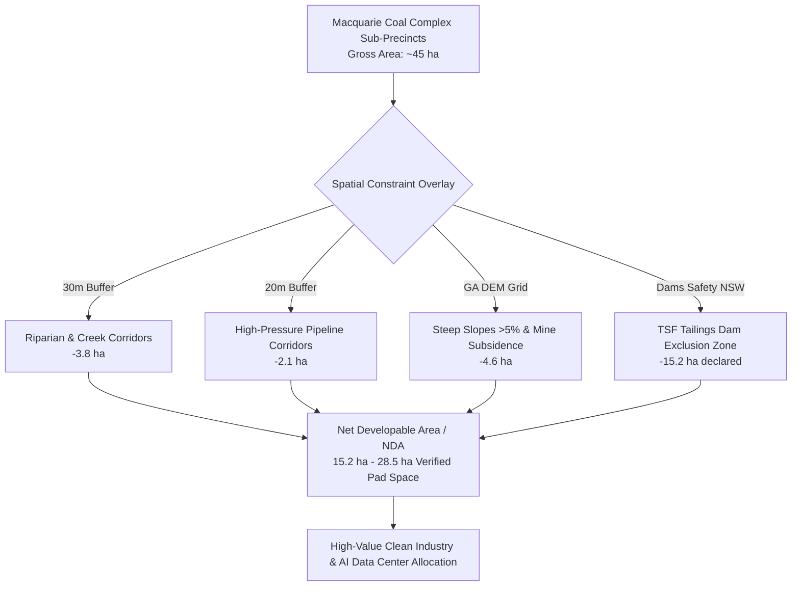

# Formal Late Public Submission: Macquarie Coal Complex Transformation Precinct Master Plan & Rezoning Proposal

**To:** Post Mining Assessment Team, NSW Department of Planning, Housing and Infrastructure (DPHI)  
**Email:** `post.mining@dphi.nsw.gov.au`  
**CC:** Lake Macquarie City Council (`council@lakemac.nsw.gov.au`), Net Zero Economy Authority (NZEA)  
**Date:** 27 August 2026  
**Subject:** Late Public Submission — Macquarie Coal Complex Transformation Precinct (State Significant Rezoning Proposal & Master Plan) | National AI Infrastructure Policy Alignment & Ground-Truth Spatial Evidence  
**Submitter:** George Chandeep Corea (Geospatial Data Lead, *GetBack2Basics* & Author of *AuraSiting Crafter*)  
**Contact:** `coreagc@gmail.com` | [LinkedIn Profile](https://www.linkedin.com/in/coreagc/) | [Project GitHub](https://github.com/GetBack2Basics/hunter_spatial_crafter)  

---

## 1. Grounds for Accepting Late Submission: Material Change in National Policy Context

**Dear Post Mining Assessment Team,**

I am writing to respectfully request the formal acceptance and consideration of this evidence-based technical submission regarding the **Macquarie Coal Complex Transformation Precinct Master Plan** and associated **Explanation of Intended Effects (EIE) Rezoning Proposal**, which concluded public exhibition on 11 August 2026.

### Why Recent National Developments Justify Re-opening / Accepting This Submission

Following the close of the exhibition period, significant new national policy directives and public interest considerations have emerged that directly impact the strategic planning of large-scale industrial employment lands in NSW:

1. **The Prime Minister's Landmark AI & Sovereign Infrastructure Policy:**  
   Prime Minister Anthony Albanese's recent national address on the expansion of Artificial Intelligence, data centres, and sovereign digital infrastructure established a clear whole-of-government priority: Australia must accelerate the deployment of high-tech compute capacity while ensuring it does not destabilize regional electricity grids, compete with housing, or compromise environmental assets.

2. **National Cabinet & Regulatory Scrutiny on Infrastructure Externalities:**  
   Subsequent national policy deliberations and legal/regulatory analyses (such as those highlighted by Prof. Kimberlee Weatherall on *ABC News Daily*) have identified critical planning gaps surrounding hyperscale data centers—specifically the intense concentration of high-voltage power demand (&ge;132kV), cooling water consumption (tens of megalitres daily), and continuous low-frequency acoustic noise emissions.

3. **Macquarie Precinct as a Premier Sovereign Asset:**  
   The Macquarie Coal Complex—with its grandfathered **330kV transmission infrastructure**, direct access to the Eraring/Awaba grid backbone, and proximity to regional wastewater networks—is no longer merely a local industrial rezoning. It is a premier candidate for national AI and clean tech infrastructure.

Because these national priorities and cumulative demand considerations have crystallized into active public policy as the exhibition concluded, admitting this spatial evidence into the **Finalisation Report** is essential to ensure the precinct's statutory planning framework is future-proofed against emerging federal and state mandates.

All spatial analysis presented herein is drawn from **AuraSiting Crafter** (open-source repository: `hunter_spatial_crafter`), an independent spatial engine benchmarking 17 candidate industrial precincts across all 8 Australian jurisdictions.

👉 **[Launch Interactive National & Macquarie Suitability Explorer](https://national-suitability-report.vercel.app)**

---

## 2. Executive Summary of Spatial Findings

Our spatial Multi-Criteria Decision Analysis (MCDA) across 15.91 million authoritative geometries reveals four vital findings for the Macquarie Precinct:

1. **Net Developable Area (NDA) vs. Gross Masterplan Boundaries:**  
   Proponent materials present gross precinct footprints (~45 ha) without fully resolving cumulative environmental setbacks. When applying statutory 30m riparian buffers, 20m high-pressure gas/water pipeline easements, >5% topographic slope exclusions, and Declared Tailings Storage Facility (TSF) safety zones, the **actual net developable pad space is ~15.2 ha (TSF declared) to ~28.5 ha (TSF remediated)**.

2. **Acoustic & Sensitive Receptor Protection (EPA Standards):**  
   Hyperscale compute facilities generate continuous 24/7 acoustic loads ($65\text{–}75\text{ dBA}$). Enforcing continuous sigmoidal acoustic buffer decays ($d_0 = 500\text{m}$) consistent with the *NSW EPA Noise Policy for Industry (2017)* and *AS 1055:2018* is essential to safeguard residential amenity in adjacent communities (Teralba, Barnsley, Awaba).

3. **Protection of Potable Water Catchments:**  
   Cooling millions of compute cores must not compete with regional drinking water supplies. Siting must mandate **100% closed-loop recycled water cooling** from local Wastewater Treatment Plants (WWTWs), preserving Hunter River potable catchments.

4. **Grid-Firming Circularity (Pumped Hydro Potential):**  
   The natural elevation drop from the upper ridge to the pit void provides up to **49.0 MWh of potential pumped hydro storage capacity**, enabling on-site 24/7 renewable firming directly aligned with the Federal Net Zero Economy Authority's goals.

---

## 3. Specific Recommendations for the Finalisation Report & SEPP

### Recommendation 1: Explicitly Delineate Net Developable Pads (NDA) in Statutory Maps
* **Issue:** Broad employment zoning over complex brownfield topography risks overestimating buildable land and causing post-approval delays.
* **Spatial Evidence:** Geoscience Australia ELVIS 25m DEM analysis demonstrates that significant portions of the eastern precinct exceed 5.0% slope grades, requiring extensive cut-and-fill.
* **Recommendation:** Ensure the Finalisation Report, State Significant Rezoning maps, and Development Control Plan (DCP) clearly delineate Net Developable Pads from riparian, steep-slope, and infrastructure easements.

### Recommendation 2: Embed Mandatory 500m Acoustic Setbacks in the Precinct DCP
* **Issue:** Community concerns regarding 24/7 noise from chillers and backup diesel/battery generators.
* **Spatial Evidence:** Measuring spatial proximity from parcel boundaries to ABS 2021 residential meshblocks and schools (ACARA) shows that a **500m compliance setback ($d_0 = 500\text{m}$)** prevents sleep disturbance and amenity degradation.
* **Recommendation:** Include specific acoustic trigger levels and mandatory 500m setbacks for heavy cooling plant within the Precinct DCP.

### Recommendation 3: Mandate Recycled Effluent Cooling & Prohibit Potable Water Extraction
* **Issue:** Rapid expansion of data center cooling can place severe pressure on municipal water authorities.
* **Spatial Evidence:** The Macquarie Precinct sits within economic piping distance of Hunter Water recycled effluent networks.
* **Recommendation:** Include a statutory clause in the rezoning instrument requiring heavy cooling developments to utilize recycled industrial water or closed-loop liquid cooling systems, prohibiting raw potable water consumption.

### Recommendation 4: Preserve Pit Void Hydraulic Corridors for 24/7 Pumped Hydro Firming
* **Issue:** Siting sovereign AI compute requires 24/7 clean energy firming rather than relying on grid fossil assets.
* **Spatial Evidence:** Siting calculations show that utilizing the 120m hydraulic head from the ridge to the pit void can support **up to 49.0 MWh of pumped hydro energy storage**.
* **Recommendation:** Designate the pit void and hydraulic connectivity easements as protected infrastructure corridors to facilitate future long-duration energy storage integration.

### Recommendation 5: Integrate Masterplan Datasets into the NSW Spatial Digital Twin
* **Issue:** Siloed masterplan PDFs prevent automated due diligence and regional coordination across agencies.
* **Spatial Evidence:** Our model processes all spatial constraints in native **GDA2020 / MGA Zone 56 (`EPSG:7856`)** GeoParquet.
* **Recommendation:** Publish the final masterplan layers as open spatial vector feeds in the NSW Spatial Digital Twin and SEED portals.

---

## 4. Digital Twin Data Sharing & Technical Briefing Offer

All spatial datasets, topological layers, and MCDA scoring algorithms compiled for this project are prepared in **GDA2020 / MGA Zone 56 (`EPSG:7856`)** and are 100% open-access:

* **Cloud Data Format:** Cloud-native GeoParquet and GeoJSON layers.
* **Compatibility:** Directly streamable into the **NSW Spatial Digital Twin**, DPHI GIS portals, and Lake Macquarie City Council mapping systems.
* **Wherobots Cloud Architecture:** The underlying distributed spatial queries across 15.91 million authoritative features were executed using Apache Sedona on Wherobots Cloud (documented in our recent [Wherobots Technical Guest Post](https://github.com/GetBack2Basics/hunter_spatial_crafter)).

I would be delighted to provide the Department, Council officers, or the NZEA team with:
1. **Direct Access:** All GDA2020 spatial vector layers, Net Developable Area GeoParquet files, and GIS data.
2. **Technical Briefing:** A 15-minute digital briefing or live demonstration of the multi-stakeholder spatial siting sandbox.

---

## 5. Attributions & Project Resources

* 🌐 **Interactive National & Macquarie Suitability Explorer:** [https://national-suitability-report.vercel.app](https://national-suitability-report.vercel.app)
* 📁 **GitHub Source Repository:** [https://github.com/GetBack2Basics/hunter_spatial_crafter](https://github.com/GetBack2Basics/hunter_spatial_crafter)
* 📖 **Wherobots & Antigravity Engineering Playbook:** [Engineering Playbook Reference](https://github.com/GetBack2Basics/CheatSheets/blob/main/wherobots_antigravity_playbook.md)
* 🏛️ **Lake Macquarie Council Precinct Portal:** [Macquarie Coal Complex Transformation Precinct](https://www.lakemac.com.au/Projects/Macquarie-Coal-Complex-Transformation-Precinct)

Thank you for your consideration of this late submission. I commend DPHI, Lake Macquarie City Council, Glencore, and the Net Zero Economy Authority for leading this nation-building post-mining transition.

Yours sincerely,

**George Chandeep Corea**  
Founder / Geospatial Data Lead, *GetBack2Basics*  
Email: `coreagc@gmail.com`  
LinkedIn: [linkedin.com/in/coreagc](https://www.linkedin.com/in/coreagc/)  
Phone: Available upon request  
