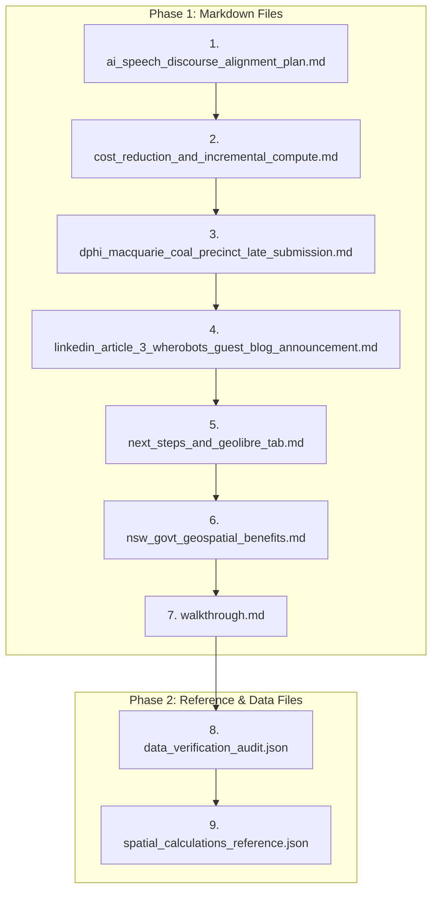

# Implementation Plan: Sequential Review & Update of Active Documents in `docs/`

Systematic, one-by-one verification and content update of all active documentation in [`docs/`](file:///c:/Projects/hunter_spatial_crafter/docs) (excluding [`docs/archive/`](file:///c:/Projects/hunter_spatial_crafter/docs/archive)) to ensure all data figures, technical benchmarks, repository paths, and policy alignments are completely current.

## User Review Required

> [!IMPORTANT]
> - [`docs/archive/`](file:///c:/Projects/hunter_spatial_crafter/docs/archive) is strictly excluded and will not be viewed or modified.
> - The review executes **one file at a time** in strict sequence: first the 7 markdown documents, then the 2 data JSON files.

## Proposed Review Sequence

---

## Proposed Changes & Audit Checklist

### Phase 1: Markdown Files (1 at a time)

#### 1. [ai_speech_discourse_alignment_plan.md](file:///c:/Projects/hunter_spatial_crafter/docs/ai_speech_discourse_alignment_plan.md)
- Verify policy alignment with latest national AI & data centre strategy discourse.
- Check hyperlinks and citations to active project assets.

#### 2. [cost_reduction_and_incremental_compute.md](file:///c:/Projects/hunter_spatial_crafter/docs/cost_reduction_and_incremental_compute.md)
- Audit spatial compute metrics (4.92M geometries, 200.6s Sedona runtime, GeoParquet/Havasu compression from 2.9GB to 430.7MB).
- Verify zero-cost DuckDB-WASM client offload architectural descriptions.

#### 3. [dphi_macquarie_coal_precinct_late_submission.md](file:///c:/Projects/hunter_spatial_crafter/docs/dphi_macquarie_coal_precinct_late_submission.md)
- Verify precinct boundary figures, Net Developable Area (NDA) calculations, and cadastral references.
- Confirm submission metadata and cross-references.

#### 4. [linkedin_article_3_wherobots_guest_blog_announcement.md](file:///c:/Projects/hunter_spatial_crafter/docs/linkedin_article_3_wherobots_guest_blog_announcement.md)
- Ensure all outbound links (Wherobots blog, GitHub repository, interactive HTML map) are accurate.

#### 5. [next_steps_and_geolibre_tab.md](file:///c:/Projects/hunter_spatial_crafter/docs/next_steps_and_geolibre_tab.md)
- Review action item status (completed vs pending), UI/UX roadmap, and GeoLibre tab specifications.

#### 6. [nsw_govt_geospatial_benefits.md](file:///c:/Projects/hunter_spatial_crafter/docs/nsw_govt_geospatial_benefits.md)
- Validate government persona alignment, policy citations, and spatial benefit matrices.

#### 7. [walkthrough.md](file:///c:/Projects/hunter_spatial_crafter/docs/walkthrough.md)
- Ensure historical walkthrough references are accurate and reflect completed project phases.

---

### Phase 2: Other Files (1 at a time)

#### 8. [data_verification_audit.json](file:///c:/Projects/hunter_spatial_crafter/docs/data_verification_audit.json)
- Verify CRS codes (EPSG:7844 / EPSG:7856 / GDA2020), layer geometry counts, and validation timestamps.

#### 9. [spatial_calculations_reference.json](file:///c:/Projects/hunter_spatial_crafter/docs/spatial_calculations_reference.json)
- Confirm mathematical weights (40% Power, 25% Sensitive, 20% Water, 15% NDA) and sigmoidal curve formulas.

---

## Verification Plan

### Automated Checks
- Validate JSON file parsing with `python -m json.tool`.
- Validate markdown links and formatting.

### Manual Verification
- Review diff of each file individually after updating.