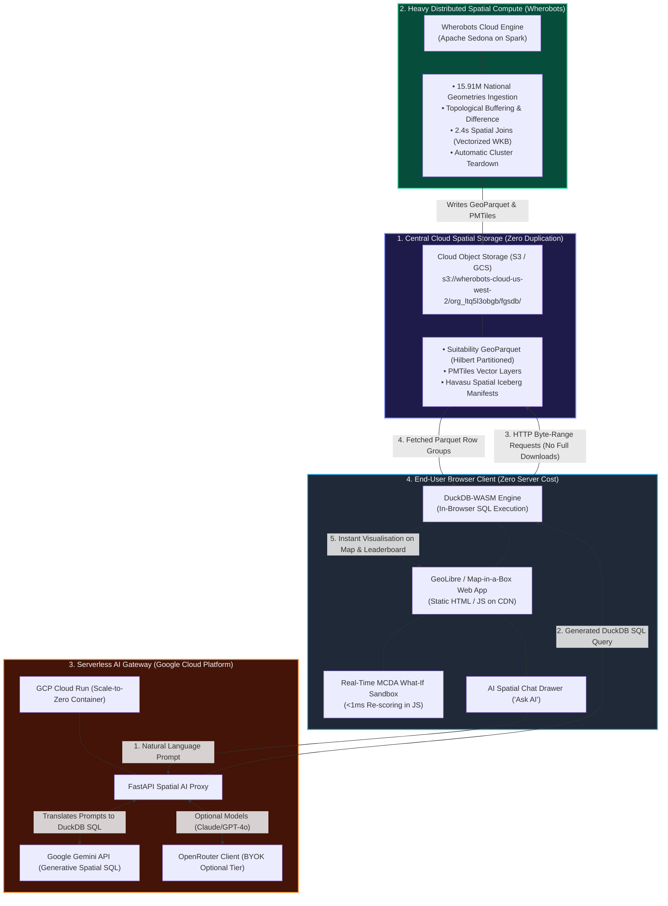

# Walkthrough: Wherobots Guest Blog Post Update & GeoLibre Architecture

This document summarizes the updates made to [`docs/wherobots_ai_data_center_suitability_blog.html`](file:///c:/Projects/hunter_spatial_crafter/docs/wherobots_ai_data_center_suitability_blog.html) and provides a comprehensive network architecture specification for **GeoLibre + Google Cloud Platform (GCP) + Wherobots Cloud + S3/GCS** to generate visual network diagrams for the blog post.

---

## 1. Summary of Changes Made to `docs/wherobots_ai_data_center_suitability_blog.html`

### A. Lead-In with Interactive Siting Explorer
- Positioned the **Interactive Siting Explorer** prompt and direct launch button (`https://national-suitability-report.vercel.app`) immediately after the intro lead paragraph.
- Added a 4-pill KPI strip displaying live numbers: **17 Candidates**, **8 States/Territories**, **15.91M Geometries**, and **2.4s Spatial Join Speed**.

### B. Full Runtime & Metric Reconciliation (Resolving Ben's Blockers)
- Replaced ambiguous/conflicting runtime statements with verified, distinct definitions:
  - **2.4 Seconds:** Core distributed Spatial SQL query execution (Apache Sedona on Wherobots Cloud) over 1.75M+ features using Havasu metadata envelope pruning, Hilbert clustering, and vectorized memory joins.
  - **18.4s ➔ 3.2s:** Query scan acceleration over 15.91M national geometries using Hilbert space-filling curve partitioning.
  - **200.6 Seconds:** Complete cold, uncached batch ETL pipeline duration (multi-layer ingestion, GDA2020 CRS transformations, `ST_MakeValid` topology repairs, and Havasu table writes).
  - **< 1 Millisecond:** Instant client-side What-If sandbox re-scoring executed in the browser via JavaScript.
- Updated dataset volume to **15,911,245 geometries across 16 authoritative national and state portals**.
- Emphasized the **85.2% storage footprint reduction** (~2.9 GB raw equivalent compressed to ~430.7 MB GeoParquet).

### C. Explicit Labeling of Simulated Baselines
- Applied `Simulated Baselines` to interstate comparison hubs (**Latrobe Valley in VIC, Collie in WA, Gladstone in QLD**) and added an explanatory callout distinguishing national modeled reference baselines from measured high-resolution Hunter micro-siting setbacks.

### D. Exposing High-Value Technical Content & Equations
- Embedded formatted Spatial SQL snippets:
  - Net developable area mask with `ST_Difference` and `ST_Union_Aggr`.
  - Geodesic distance joins with `ST_Distance` and `ST_Transform` (`EPSG:4326` to `EPSG:7856`).
- Embedded the mathematical **4-Factor MCDA Formula**:
  $$\text{Suitability} = 0.40 \cdot S_{\text{power}} + 0.25 \cdot S_{\text{sensitive}} + 0.20 \cdot S_{\text{water}} + 0.15 \cdot S_{\text{size}}$$
- Embedded the continuous sigmoidal acoustic setback equation:
  $$S_{\text{sensitive}}(d) = \frac{1}{1 + e^{-0.01 \cdot (d - 500)}}$$
- Formatted the 4 pillars of Wherobots query performance (Zero-Scan Metadata Pruning, Hilbert Clustering, Vectorized Memory Execution, and Parallel Distributed Joins).

### E. Author Roadmap & Open-Source GeoLibre Integration
- Explicitly marked future development as **Author Roadmap**, not current shipped Wherobots features.
- Clarified the **GeoLibre** (`opengeos/GeoLibre`) integration, zero-duplication cloud storage, DuckDB-WASM execution, and Google Cloud Gemini API integration.

---

## 2. GeoLibre + GCP + Wherobots Network Diagram Specification

To generate visual network diagrams or architectural infographics for the blog post, the system is designed around three distinct tiers:

---

## 3. Key Architectural Principles of the Network Diagram

1. **Zero-Duplication Unified Data Layer**:
   - Wherobots Cloud computes heavy spatial joins once and writes optimized **GeoParquet** and **PMTiles** directly to central cloud storage (S3 / GCS).
   - Neither GCP web servers nor the user browser ever maintain a full duplicate copy of the dataset.

2. **HTTP Range-Request In-Browser Compute**:
   - The user browser runs **DuckDB-WASM**, executing spatial SQL queries by reading only specific byte ranges from cloud storage via standard HTTP `Range:` headers.
   - Eliminates multi-gigabyte downloads on client devices and eliminates expensive server-side NVMe disk caching.

3. **Dual-Cloud Cost & Performance Optimization**:
   - **Wherobots Cloud (AWS us-west-2)**: Powers distributed heavy spatial computing (Apache Sedona, Havasu metadata pruning, spatial cross-joins). Runtimes auto-stop immediately upon completion to avoid idle charges.
   - **Google Cloud Platform (GCP Cloud Run)**: Powers the scale-to-zero serverless AI translation proxy connected to Google Gemini (high free tier, zero baseline running cost).

4. **Conversational "Ask AI" Flow**:
   - **User Input:** Natural language question in the chat drawer (e.g. *"Find candidate sites in VIC >10 ha within 2km of 330kV lines and >1km from schools"*).
   - **AI Translation (Cloud Run + Gemini):** Generates clean DuckDB Spatial SQL querying the remote GeoParquet URL with byte-range filtering.
   - **In-Browser Execution (DuckDB-WASM):** Executes in milliseconds in the browser, instantly highlighting matching parcels on the map and updating the leaderboard.
